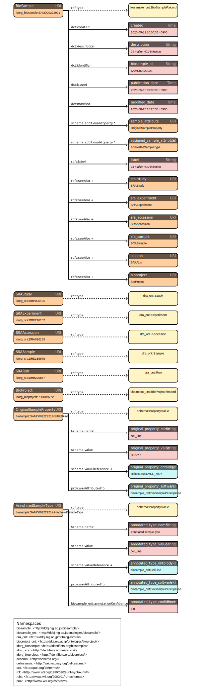
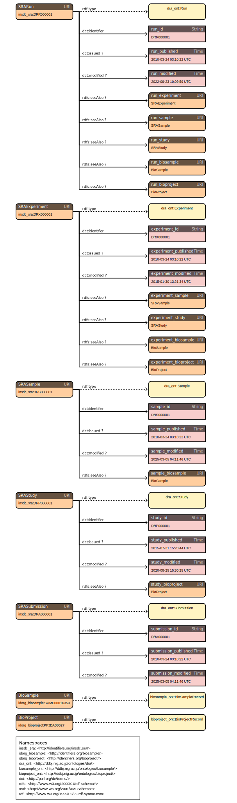
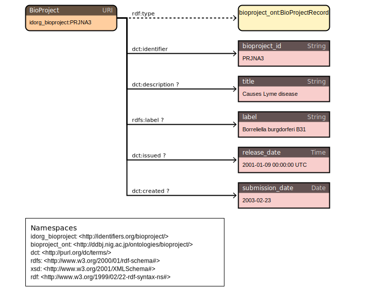

# insdc-rdf

Convert [INSDC](https://www.insdc.org/) sequence archive metadata to RDF. Streams full NCBI data dumps through single-pass chunked pipelines, producing **Turtle**, **JSON-LD**, and **N-Triples** output for three data sources:

- **BioSample** — sample metadata from `biosample_set.xml.gz`
- **SRA** — accession cross-links from `SRA_Accessions.tab`
- **BioProject** — project metadata from `bioproject.xml`

### Summary

insdc-rdf is a Rust CLI tool that converts the complete NCBI/INSDC metadata ecosystem into linked RDF. It replaces the legacy [biosampleplus-pipeline](https://github.com/inutano/biosampleplus-pipeline) (Ruby/AWK) with a modern, streaming architecture that processes 183 million records across three sources in under 90 minutes, producing 4.4 billion RDF triples.

| | Records | Triples | Conversion time |
|---|---|---|---|
| BioSample | 53.3M | ~2.9B | 55 min |
| SRA | 129.1M | ~1.1B | 29 min |
| BioProject | 823K | ~4.3M | 20 sec |
| **Total** | **183.3M** | **4.4B** | **~85 min** |

The output has been validated by loading all 4.4 billion triples into [QLever](https://github.com/ad-freiburg/qlever) and [Oxigraph](https://github.com/oxigraph/oxigraph), with SPARQL queries confirming all record counts match and spot checks returning correct data. Schema definitions follow the [rdf-config](https://github.com/dbcls/rdf-config) convention with generated ShEx validation shapes.

## Install

```bash
cargo install --path .
```

## Usage

```bash
# BioSample (XML, supports .gz)
insdc-rdf convert --source biosample --input biosample_set.xml.gz --output-dir output/biosample

# SRA accession cross-links (TSV)
insdc-rdf convert --source sra --input SRA_Accessions.tab --output-dir output/sra

# BioProject (XML)
insdc-rdf convert --source bioproject --input bioproject.xml --output-dir output/bioproject
```

Options:

| Flag | Default | Description |
|------|---------|-------------|
| `-s, --source` | `biosample` | Data source: `biosample`, `sra`, `bioproject` |
| `-i, --input` | (required) | Path to input file |
| `-o, --output-dir` | `./output` | Output directory |
| `-c, --chunk-size` | `100000` | Records per output chunk |

### Validate

```bash
insdc-rdf validate output/biosample
```

### Output structure

Each source produces the same directory layout:

```
output/<source>/
  ttl/chunk_0000.ttl ... chunk_NNNN.ttl
  jsonld/chunk_0000.jsonld ... chunk_NNNN.jsonld
  nt/chunk_0000.nt ... chunk_NNNN.nt
  manifest.json
  progress.json
  errors.log
```

## Data sources

Download from NCBI FTP:

```bash
# BioSample (~4 GB)
curl -O https://ftp.ncbi.nlm.nih.gov/biosample/biosample_set.xml.gz

# SRA Accessions (~30 GB)
curl -O https://ftp.ncbi.nlm.nih.gov/sra/reports/Metadata/SRA_Accessions.tab

# BioProject (~3.7 GB)
curl -O https://ftp.ncbi.nlm.nih.gov/bioproject/bioproject.xml
```

## RDF schemas

Schema diagrams generated by [rdf-config](https://github.com/dbcls/rdf-config). An [interactive viewer](docs/schema.html) with zoom, pan, copy, and download is available in the repo.

### BioSample

<a href="config/biosample/schema.svg"></a>

```turtle
idorg:SAMN00000002
  a ddbjont:BioSampleRecord ;
  dct:identifier "SAMN00000002" ;
  dct:description "Alistipes putredinis DSM 17216" ;
  rdfs:label "Alistipes putredinis DSM 17216" ;
  dct:created "2008-04-04T08:44:24.950"^^xsd:dateTime ;
  :additionalProperty <http://ddbj.nig.ac.jp/biosample/SAMN00000002#organism> .

<http://ddbj.nig.ac.jp/biosample/SAMN00000002#organism>
  a :PropertyValue ;
  :name "organism" ;
  :value "Alistipes putredinis DSM 17216" .
```

### SRA

<a href="config/sra/schema.svg"></a>

```turtle
insdc_sra:DRR000001
  a dra_ont:Run ;
  dct:identifier "DRR000001" ;
  dct:issued "2010-03-24T03:10:22Z"^^xsd:dateTime ;
  rdfs:seeAlso insdc_sra:DRX000001 ;
  rdfs:seeAlso insdc_sra:DRS000001 ;
  rdfs:seeAlso insdc_sra:DRP000001 ;
  rdfs:seeAlso idorg_biosample:SAMD00016353 ;
  rdfs:seeAlso idorg_bioproject:PRJDA38027 .
```

### BioProject

<a href="config/bioproject/schema.svg"></a>

```turtle
idorg_bp:PRJNA3
  a bp_ont:BioProjectRecord ;
  dct:identifier "PRJNA3" ;
  dct:description "Causes Lyme disease" ;
  rdfs:label "Borreliella burgdorferi B31" ;
  dct:issued "2001-01-09T00:00:00Z"^^xsd:dateTime .
```

## rdf-config & ShEx

Schema definitions using [rdf-config](https://github.com/dbcls/rdf-config) are in `config/`:

```
config/
  biosample/   model.yaml, prefix.yaml, sparql.yaml, shape.shex, ...
  sra/         model.yaml, prefix.yaml, sparql.yaml, shape.shex, ...
  bioproject/  model.yaml, prefix.yaml, sparql.yaml, shape.shex, ...
```

Generate ShEx validation schemas:

```bash
# Requires rdf-config (Ruby)
bundle exec rdf-config --config config/biosample --shex
bundle exec rdf-config --config config/sra --shex
bundle exec rdf-config --config config/bioproject --shex
```

## Benchmark

Full NCBI dumps (2026-04-01/02):

| Source | Input | Records | Skipped | Output | Time | Throughput |
|--------|-------|---------|---------|--------|------|------------|
| BioSample | 4.0 GB (gzip) | 53,342,722 | 0 | 785 GB | 55 min | 16.2k rec/s |
| SRA | 30 GB (TSV) | 129,100,540 | 0 | 284 GB | 29 min | 74k rec/s |
| BioProject | 3.7 GB (XML) | 823,572 | 1 | 1.3 GB | 20 sec | 41k rec/s |

Local workstation: Intel Xeon w5-3435X, 128 GB RAM, NVMe/HDD storage.

NIG supercomputer (EPYC 9654, Lustre): ~0.72x local throughput for BioSample (Lustre I/O bound).

## Validation with QLever

The generated RDF can be loaded into [QLever](https://github.com/ad-freiburg/qlever) (University of Freiburg) for SPARQL querying and validation.

### Setup

```bash
# Install qlever CLI (uses Docker)
pip install qlever

# Index all N-Triples output
docker run --rm -u $(id -u):$(id -g) \
  -v /path/to/qlever-workdir:/index \
  -v /path/to/biosample/nt:/nt-biosample:ro \
  -v /path/to/sra/nt:/nt-sra:ro \
  -v /path/to/bioproject/nt:/nt-bioproject:ro \
  -w /index --init --entrypoint bash \
  docker.io/adfreiburg/qlever -c \
  'qlever-index -i insdc-rdf -s insdc-rdf.settings.json \
    --vocabulary-type on-disk-compressed \
    -f <(cat /nt-bioproject/*.nt /nt-biosample/*.nt /nt-sra/*.nt) \
    -g - -F nt -p false --stxxl-memory 10G'

# Start SPARQL endpoint
qlever start --name insdc-rdf \
  --description "INSDC RDF" \
  --port 7001 --memory-for-queries 20G --system docker
```

### Triplestore comparison

Loaded all N-Triples output (~550 GB, 4.4 billion triples) into QLever and [Oxigraph](https://github.com/oxigraph/oxigraph):

| Metric | QLever | Oxigraph |
|--------|--------|----------|
| Load/index time | ~22 hours | ~23 hours (+3h optimize) |
| Store size on disk | 54 GB | 333 GB |
| Record count by type | 16 ms | 6 min 50 sec |
| Single record lookup | 21 ms | 45-111 ms |
| Total triples | 4,398,520,726 | 4,398,520,726 |

QLever excels at aggregation queries over billions of triples. Oxigraph is simpler to set up (single binary) and fast for point lookups.

### Record counts (SPARQL validation)

```sparql
SELECT ?type (COUNT(?s) AS ?count) WHERE { ?s a ?type . } GROUP BY ?type ORDER BY DESC(?count)
```

| Type | Count |
|------|-------|
| schema:PropertyValue | 775,089,741 |
| biosample_ont:BioSampleRecord | 53,342,722 |
| dra_ont:Run | 41,361,437 |
| dra_ont:Sample | 40,399,579 |
| dra_ont:Experiment | 38,978,968 |
| dra_ont:Submission | 7,509,943 |
| bioproject_ont:BioProjectRecord | 823,572 |
| dra_ont:Study | 705,171 |
| dra_ont:Analysis | 145,442 |

All counts match the conversion manifests exactly. Query response time: 16 ms.

### Spot checks

BioSample record with attributes:

```sparql
SELECT ?p ?o WHERE {
  <http://identifiers.org/biosample/SAMN00000002> ?p ?o .
} ORDER BY ?p
```

| Predicate | Object |
|-----------|--------|
| dct:created | 2008-04-04T08:44:24.950 |
| dct:description | "Alistipes putredinis DSM 17216" |
| dct:identifier | "SAMN00000002" |
| dct:issued | 2008-04-04T00:00:00 |
| dct:modified | 2022-09-25T02:00:02.729 |
| rdfs:label | "Alistipes putredinis DSM 17216" |
| rdf:type | biosample_ont:BioSampleRecord |
| schema:additionalProperty | (27 PropertyValue nodes) |

SRA run cross-links:

```sparql
SELECT ?p ?o WHERE {
  <http://identifiers.org/insdc.sra/DRR000001> ?p ?o .
} ORDER BY ?p
```

| Predicate | Object |
|-----------|--------|
| dct:identifier | "DRR000001" |
| dct:issued | 2010-03-24T03:10:22Z |
| dct:modified | 2022-09-23T10:09:59Z |
| rdf:type | dra_ont:Run |
| rdfs:seeAlso | insdc_sra:DRX000001, insdc_sra:DRS000001, insdc_sra:DRP000001 |
| rdfs:seeAlso | idorg_biosample:SAMD00016353, idorg_bioproject:PRJDA38027 |

BioProject metadata:

```sparql
SELECT ?p ?o WHERE {
  <http://identifiers.org/bioproject/PRJNA3> ?p ?o .
} ORDER BY ?p
```

| Predicate | Object |
|-----------|--------|
| dct:created | "2003-02-23" |
| dct:description | "Causes Lyme disease" |
| dct:identifier | "PRJNA3" |
| dct:issued | 2001-01-09T00:00:00Z |
| rdf:type | bioproject_ont:BioProjectRecord |
| rdfs:label | "Borreliella burgdorferi B31" |

### Predicate distribution

```sparql
SELECT ?p (COUNT(*) AS ?count) WHERE { ?s ?p ?o . } GROUP BY ?p ORDER BY DESC(?count)
```

See `scripts/validate_sparql_qlever.sh` for the full set of validation queries.

## Project structure

```
insdc-rdf/
  crates/
    core/           Shared types: Progress, Manifest, Error, prefixes, escape
    biosample/      BioSample XML parser + serializers
    sra/            SRA TSV parser + serializers
    bioproject/     BioProject XML parser + serializers
  src/main.rs       Unified CLI
  config/           rdf-config YAML schemas + ShEx
  scripts/          Daily update and Slurm job scripts
  tests/fixtures/   Test data
```

## License

MIT
