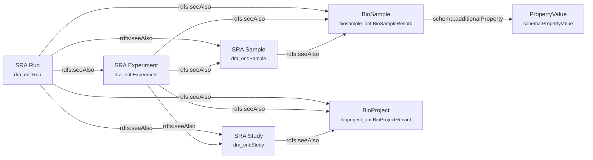
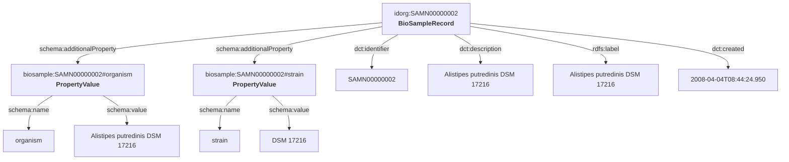
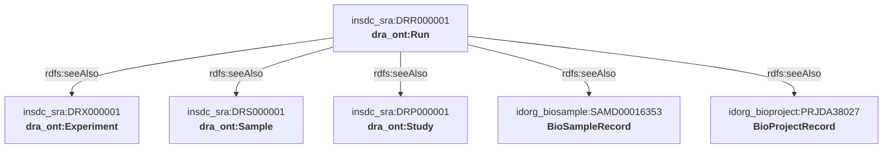
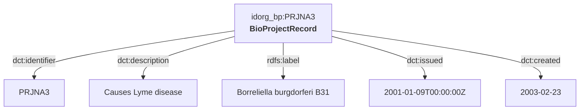

# insdc-rdf

Convert [INSDC](https://www.insdc.org/) sequence archive metadata to RDF. Streams full NCBI data dumps through single-pass chunked pipelines, producing **Turtle**, **JSON-LD**, and **N-Triples** output for three data sources:

- **BioSample** — sample metadata from `biosample_set.xml.gz`
- **SRA** — accession cross-links from `SRA_Accessions.tab`
- **BioProject** — project metadata from `bioproject.xml`

## Install

```bash
cargo install --path .
```

## Usage

```bash
# BioSample (XML, supports .gz)
insdc-rdf convert --source biosample --input biosample_set.xml.gz --output-dir output/biosample

# SRA accession cross-links (TSV)
insdc-rdf convert --source sra --input SRA_Accessions.tab --output-dir output/sra

# BioProject (XML)
insdc-rdf convert --source bioproject --input bioproject.xml --output-dir output/bioproject
```

Options:

| Flag | Default | Description |
|------|---------|-------------|
| `-s, --source` | `biosample` | Data source: `biosample`, `sra`, `bioproject` |
| `-i, --input` | (required) | Path to input file |
| `-o, --output-dir` | `./output` | Output directory |
| `-c, --chunk-size` | `100000` | Records per output chunk |

### Validate

```bash
insdc-rdf validate output/biosample
```

### Output structure

Each source produces the same directory layout:

```
output/<source>/
  ttl/chunk_0000.ttl ... chunk_NNNN.ttl
  jsonld/chunk_0000.jsonld ... chunk_NNNN.jsonld
  nt/chunk_0000.nt ... chunk_NNNN.nt
  manifest.json
  progress.json
  errors.log
```

## Data sources

Download from NCBI FTP:

```bash
# BioSample (~4 GB)
curl -O https://ftp.ncbi.nlm.nih.gov/biosample/biosample_set.xml.gz

# SRA Accessions (~30 GB)
curl -O https://ftp.ncbi.nlm.nih.gov/sra/reports/Metadata/SRA_Accessions.tab

# BioProject (~3.7 GB)
curl -O https://ftp.ncbi.nlm.nih.gov/bioproject/bioproject.xml
```

## RDF schemas

> Detailed SVG diagrams generated by [rdf-config](https://github.com/dbcls/rdf-config) are available in [`config/*/schema.svg`](config/).

### Overview



### BioSample



```turtle
idorg:SAMN00000002
  a ddbjont:BioSampleRecord ;
  dct:identifier "SAMN00000002" ;
  dct:description "Alistipes putredinis DSM 17216" ;
  rdfs:label "Alistipes putredinis DSM 17216" ;
  dct:created "2008-04-04T08:44:24.950"^^xsd:dateTime ;
  :additionalProperty <http://ddbj.nig.ac.jp/biosample/SAMN00000002#organism> .

<http://ddbj.nig.ac.jp/biosample/SAMN00000002#organism>
  a :PropertyValue ;
  :name "organism" ;
  :value "Alistipes putredinis DSM 17216" .
```

### SRA



```turtle
insdc_sra:DRR000001
  a dra_ont:Run ;
  dct:identifier "DRR000001" ;
  dct:issued "2010-03-24T03:10:22Z"^^xsd:dateTime ;
  rdfs:seeAlso insdc_sra:DRX000001 ;
  rdfs:seeAlso insdc_sra:DRS000001 ;
  rdfs:seeAlso insdc_sra:DRP000001 ;
  rdfs:seeAlso idorg_biosample:SAMD00016353 ;
  rdfs:seeAlso idorg_bioproject:PRJDA38027 .
```

### BioProject



```turtle
idorg_bp:PRJNA3
  a bp_ont:BioProjectRecord ;
  dct:identifier "PRJNA3" ;
  dct:description "Causes Lyme disease" ;
  rdfs:label "Borreliella burgdorferi B31" ;
  dct:issued "2001-01-09T00:00:00Z"^^xsd:dateTime .
```

## rdf-config & ShEx

Schema definitions using [rdf-config](https://github.com/dbcls/rdf-config) are in `config/`:

```
config/
  biosample/   model.yaml, prefix.yaml, sparql.yaml, shape.shex, ...
  sra/         model.yaml, prefix.yaml, sparql.yaml, shape.shex, ...
  bioproject/  model.yaml, prefix.yaml, sparql.yaml, shape.shex, ...
```

Generate ShEx validation schemas:

```bash
# Requires rdf-config (Ruby)
bundle exec rdf-config --config config/biosample --shex
bundle exec rdf-config --config config/sra --shex
bundle exec rdf-config --config config/bioproject --shex
```

## Benchmark

Full NCBI dumps (2026-04-01/02):

| Source | Input | Records | Skipped | Output | Time | Throughput |
|--------|-------|---------|---------|--------|------|------------|
| BioSample | 4.0 GB (gzip) | 53,342,722 | 0 | 785 GB | 55 min | 16.2k rec/s |
| SRA | 30 GB (TSV) | 129,100,540 | 0 | 284 GB | 29 min | 74k rec/s |
| BioProject | 3.7 GB (XML) | TBD | — | — | — | — |

Hardware: Intel Xeon w5-3435X, 128 GB RAM, NVMe/HDD storage.

## Project structure

```
insdc-rdf/
  crates/
    core/           Shared types: Progress, Manifest, Error, prefixes, escape
    biosample/      BioSample XML parser + serializers
    sra/            SRA TSV parser + serializers
    bioproject/     BioProject XML parser + serializers
  src/main.rs       Unified CLI
  config/           rdf-config YAML schemas + ShEx
  scripts/          Daily update and Slurm job scripts
  tests/fixtures/   Test data
```

## License

MIT
