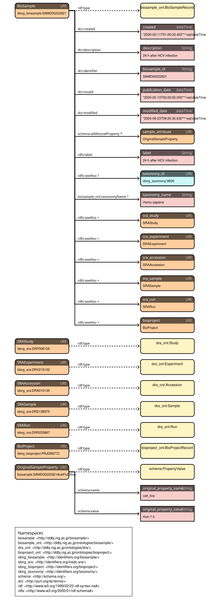
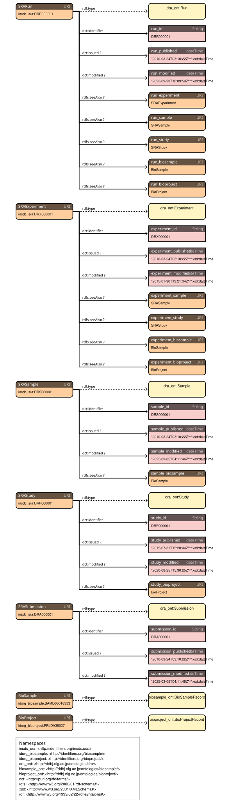
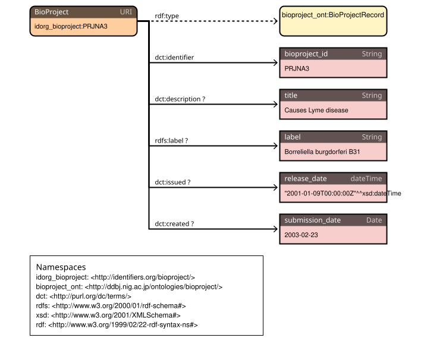
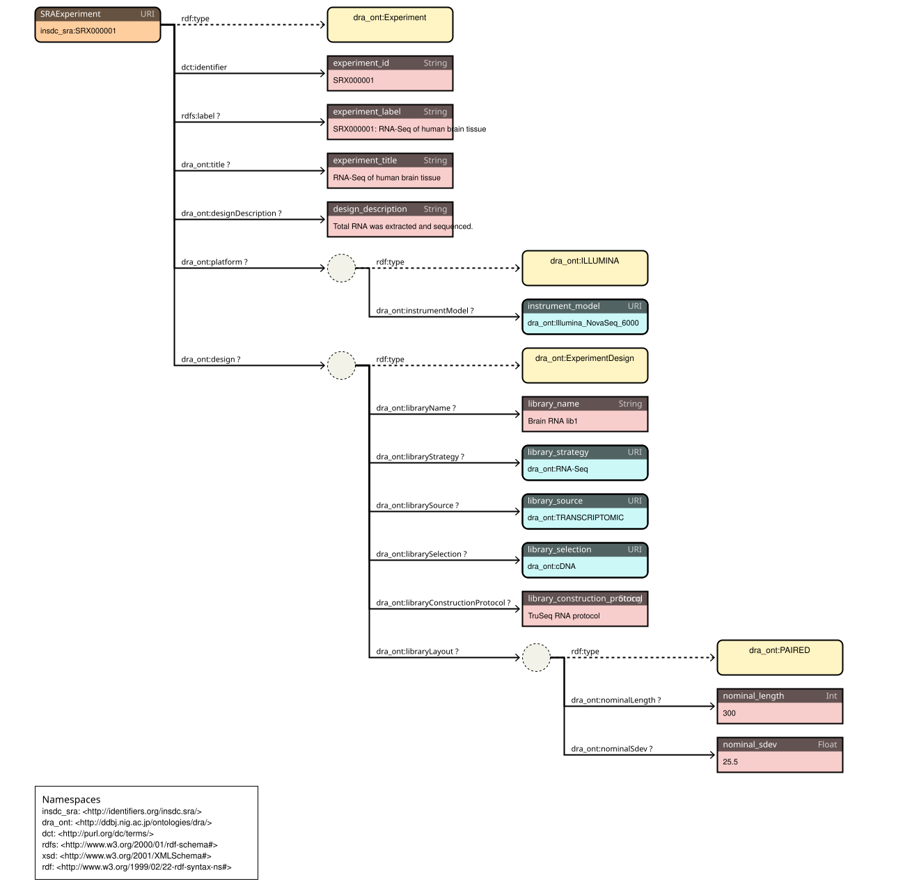
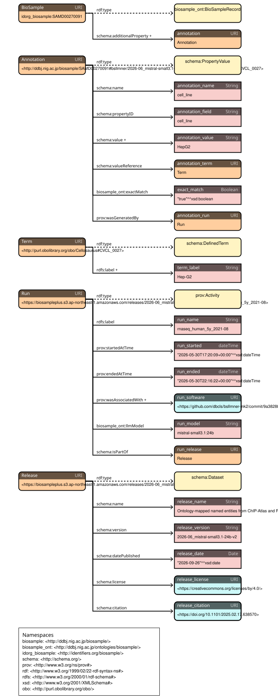

# insdc-rdf

Convert [INSDC](https://www.insdc.org/) sequence archive metadata to RDF. Streams full NCBI data dumps through single-pass chunked pipelines, producing **Turtle**, **JSON-LD**, and **N-Triples** output for four INSDC data sources, plus ontology annotations from bsllmner-mk2:

- **BioSample** — sample metadata from `biosample_set.xml.gz`
- **SRA** — accession cross-links from `SRA_Accessions.tab`
- **BioProject** — project metadata from `bioproject.xml`
- **SRA Experiment** — experiment-level metadata (platform, library info) from `NCBI_SRA_Metadata_Full_*.tar[.gz]`
- **bsllmner-mk2 annotations** — ontology terms extracted from BioSample records by an LLM, from a [BioSample Plus](https://biosampleplus.s3.ap-northeast-1.amazonaws.com/index.html) RO-Crate release

### Summary

insdc-rdf is a Rust CLI tool that converts the complete NCBI/INSDC metadata ecosystem into linked RDF. It replaces the legacy [biosampleplus-pipeline](https://github.com/inutano/biosampleplus-pipeline) (Ruby/AWK) with a modern, streaming architecture that processes 250 million records across five sources in about two hours.

| | Records | Triples | Conversion time |
|---|---|---|---|
| BioSample | 60.1M | ~4.0B | 71 min |
| SRA | 143.2M | ~1.0B | 29 min |
| BioProject | 1.12M | ~5.8M | 23 sec |
| SRA Experiment | 41.6M | ~0.66B | 18 min |
| bsllmner-mk2 | 4.19M | ~47M | 2 min |
| **Total** | **250.2M** | **~5.8B** | **~121 min** |

NCBI dumps of 2026-10-07 (SRA Experiment: 2026-09-13); bsllmner release 2026-06_mistral-small3.1-24b-v2.

The Triples column counts N-Triples lines. 88,250,905 lines of the 2026-10 INSDC output repeat a triple. 83,186,604 of them come from `sra` and `sra-experiment`, which both write the `rdf:type` and `dct:identifier` of each of the 41,593,302 experiments. The remaining 5,064,301 are statements that the source data repeat, such as an attribute a BioSample lists twice, whose `rdf:type`, `schema:name` and `schema:additionalProperty` triples then recur. A triplestore keeps one copy, so the INSDC output holds 5,621,216,568 distinct triples.

The 2026-10 output was validated by loading it, together with the bsllmner annotations and the ontology files they use, into [QLever](https://github.com/ad-freiburg/qlever). The load gave 5,760,937,728 N-Triples lines and 5,672,544,678 distinct triples. Record counts match the conversion manifests and the source files, and spot checks return the expected data. Schema definitions follow the [rdf-config](https://github.com/dbcls/rdf-config) convention with generated ShEx validation shapes.

## Install

```bash
cargo install --path .
```

## Usage

```bash
# BioSample (XML, supports .gz)
insdc-rdf convert --source biosample --input biosample_set.xml.gz --output-dir output/biosample

# SRA accession cross-links (TSV)
insdc-rdf convert --source sra --input SRA_Accessions.tab --output-dir output/sra

# BioProject (XML)
insdc-rdf convert --source bioproject --input bioproject.xml --output-dir output/bioproject

# SRA Experiment metadata (tar or tar.gz of per-submission XML files; format auto-detected)
insdc-rdf convert --source sra-experiment --input NCBI_SRA_Metadata_Full_20260316.tar.gz --output-dir output/sra-experiment

# bsllmner-mk2 annotations (unpacked RO-Crate release directory)
curl -O https://biosampleplus.s3.ap-northeast-1.amazonaws.com/releases/2026-06_mistral-small3.1-24b-v2.tar.gz
tar xzf 2026-06_mistral-small3.1-24b-v2.tar.gz
insdc-rdf convert --source bsllmner --input 2026-06_mistral-small3.1-24b-v2 --output-dir output/bsllmner
```

Options:

| Flag | Default | Description |
|------|---------|-------------|
| `-s, --source` | `biosample` | Data source: `biosample`, `sra`, `bioproject`, `sra-experiment`, `bsllmner` |
| `-i, --input` | (required) | Path to input file (for `bsllmner`: the unpacked RO-Crate directory) |
| `-o, --output-dir` | `./output` | Output directory |
| `-c, --chunk-size` | `100000` | Records per output chunk |

The bsllmner converter refuses an output directory that already holds chunks.

### Validate

```bash
insdc-rdf validate output/biosample
```

### Output structure

Each source produces the same directory layout:

```
output/<source>/
  ttl/chunk_0000.ttl ... chunk_NNNN.ttl
  jsonld/chunk_0000.jsonld ... chunk_NNNN.jsonld
  nt/chunk_0000.nt ... chunk_NNNN.nt
  manifest.json
  progress.json
  errors.log
```

## Data sources

Download from NCBI FTP:

```bash
# BioSample (~4 GB)
curl -O https://ftp.ncbi.nlm.nih.gov/biosample/biosample_set.xml.gz

# SRA Accessions (~30 GB)
curl -O https://ftp.ncbi.nlm.nih.gov/sra/reports/Metadata/SRA_Accessions.tab

# BioProject (~3.7 GB)
curl -O https://ftp.ncbi.nlm.nih.gov/bioproject/bioproject.xml

# SRA Experiment metadata (~15 GB, monthly Full dump)
curl -O https://ftp.ncbi.nlm.nih.gov/sra/reports/Metadata/NCBI_SRA_Metadata_Full_20260316.tar.gz
```

## RDF schemas

Schema diagrams generated by [rdf-config](https://github.com/dbcls/rdf-config). An [interactive viewer](docs/schema.html) with zoom, pan, copy, and download is available in the repo.

### BioSample

<a href="config/biosample/schema.svg"></a>

```turtle
idorg:SAMN00000002
  a ddbjont:BioSampleRecord ;
  dct:identifier "SAMN00000002" ;
  dct:description "Alistipes putredinis DSM 17216" ;
  rdfs:label "Alistipes putredinis DSM 17216" ;
  dct:created "2008-04-04T08:44:24.950"^^xsd:dateTime ;
  :additionalProperty <http://ddbj.nig.ac.jp/biosample/SAMN00000002#organism> .

<http://ddbj.nig.ac.jp/biosample/SAMN00000002#organism>
  a :PropertyValue ;
  :name "organism" ;
  :value "Alistipes putredinis DSM 17216" .
```

A record with an organism also links its NCBI Taxonomy IRI with `rdfs:seeAlso <http://identifiers.org/taxonomy/{taxonomy_id}>` and gives the organism name as `biosample_ont:taxonomyName`.

### SRA

<a href="config/sra/schema.svg"></a>

```turtle
insdc_sra:DRR000001
  a dra_ont:Run ;
  dct:identifier "DRR000001" ;
  dct:issued "2010-03-24T03:10:22Z"^^xsd:dateTime ;
  rdfs:seeAlso insdc_sra:DRX000001 ;
  rdfs:seeAlso insdc_sra:DRS000001 ;
  rdfs:seeAlso insdc_sra:DRP000001 ;
  rdfs:seeAlso idorg_biosample:SAMD00016353 ;
  rdfs:seeAlso idorg_bioproject:PRJDA38027 .
```

### BioProject

<a href="config/bioproject/schema.svg"></a>

```turtle
idorg_bp:PRJNA3
  a bp_ont:BioProjectRecord ;
  dct:identifier "PRJNA3" ;
  dct:description "Causes Lyme disease" ;
  rdfs:label "Borreliella burgdorferi B31" ;
  dct:issued "2001-01-09T00:00:00Z"^^xsd:dateTime .
```

### SRA Experiment

<a href="config/sra-experiment/schema.svg"></a>

```turtle
insdc_sra:SRX000001
  a dra_ont:Experiment ;
  rdfs:label "SRX000001: RNA-Seq of human brain tissue" ;
  dct:identifier "SRX000001" ;
  dra_ont:title "RNA-Seq of human brain tissue" ;
  dra_ont:designDescription "Total RNA was extracted and sequenced." ;
  dra_ont:platform [
    a dra_ont:ILLUMINA ;
    dra_ont:instrumentModel dra_ont:Illumina_NovaSeq_6000
  ] ;
  dra_ont:design [
    a dra_ont:ExperimentDesign ;
    dra_ont:libraryName "Brain RNA lib1" ;
    dra_ont:libraryStrategy dra_ont:RNA-Seq ;
    dra_ont:librarySource dra_ont:TRANSCRIPTOMIC ;
    dra_ont:librarySelection dra_ont:cDNA ;
    dra_ont:libraryConstructionProtocol "TruSeq RNA protocol" ;
    dra_ont:libraryLayout [
      a dra_ont:PAIRED ;
      dra_ont:nominalLength "300"^^xsd:decimal ;
      dra_ont:nominalSdev "25.5"^^xsd:decimal
    ]
  ] .
```

### bsllmner-mk2 annotations

<a href="config/bsllmner/schema.svg"></a>

Each ontology term that bsllmner-mk2 assigned to a BioSample field becomes a `schema:PropertyValue` node attached with `schema:additionalProperty`. The prefix `rel:` below stands for the release IRI.

```turtle
@prefix rel: <https://biosampleplus.s3.ap-northeast-1.amazonaws.com/releases/2026-06_mistral-small3.1-24b-v2/> .

idorg_biosample:SAMD00270091
  schema:additionalProperty <http://ddbj.nig.ac.jp/biosample/SAMD00270091#bsllmner/2026-06_mistral-small3.1-24b-v2/rnaseq_human_5y/cell_line/CVCL_0027> .

<http://ddbj.nig.ac.jp/biosample/SAMD00270091#bsllmner/2026-06_mistral-small3.1-24b-v2/rnaseq_human_5y/cell_line/CVCL_0027>
  a schema:PropertyValue ;
  schema:propertyID "cell_line" ;
  schema:value "HepG2" ;
  schema:valueReference <http://purl.obolibrary.org/obo/Cellosaurus#CVCL_0027> ;
  biosample_ont:exactMatch true ;
  prov:wasGeneratedBy <https://biosampleplus.s3.ap-northeast-1.amazonaws.com/releases/2026-06_mistral-small3.1-24b-v2/#run-rnaseq_human_5y_2021-08> .

<http://purl.obolibrary.org/obo/Cellosaurus#CVCL_0027>
  a schema:DefinedTerm ;
  rdfs:label "Hep-G2" .
```

Provenance (one `schema:Dataset` for the release, one `prov:Activity` per bsllmner run):

```turtle
<https://biosampleplus.s3.ap-northeast-1.amazonaws.com/releases/2026-06_mistral-small3.1-24b-v2/#run-rnaseq_human_5y_2021-08>
  a prov:Activity ;
  rdfs:label "rnaseq_human_5y_2021-08" ;
  prov:startedAtTime "2026-05-30T17:20:09+00:00"^^xsd:dateTime ;
  prov:endedAtTime "2026-05-30T22:16:22+00:00"^^xsd:dateTime ;
  prov:wasAssociatedWith <https://github.com/dbcls/bsllmner-mk2/commit/9a3828811f1ab4bac85615e0e1b2efcc6603265f> ;
  biosample_ont:llmModel "mistral-small3.1:24b" ;
  schema:isPartOf rel: .

rel:
  a schema:Dataset ;
  schema:name "Ontology-mapped named entities from ChIP-Atlas and RNA-Seq BioSample records" ;
  schema:version "2026-06_mistral-small3.1-24b-v2" ;
  schema:datePublished "2026-09-26"^^xsd:date ;
  schema:license <https://creativecommons.org/licenses/by/4.0/> ;
  schema:citation <https://doi.org/10.1101/2025.02.17.638570> .
```

- **IRI pattern**: annotation nodes are `http://ddbj.nig.ac.jp/biosample/{accession}#bsllmner/{release_id}/{dataset}/{field}/{term_local}`, where `term_local` is the term id with `:` replaced by `_` (`CVCL:0027` becomes `CVCL_0027`).
- **Merging**: items of one entry and field that share a term become one node, with one `schema:value` per distinct extracted value. `biosample_ont:exactMatch` is `true` if the selected term matched the extracted value exactly on a label or synonym, and `false` if it was chosen by text2term similarity; for a merged node it is `true` if any merged item was exact.
- **Datasets kept apart**: the dataset name is part of the node IRI. 1,331 accessions are annotated in two datasets (e.g. ChIP-Atlas and RNA-Seq) and get two node sets, so count samples with `COUNT(DISTINCT ?bs)`.
- **Distinguishing from original attributes**: bsllmner nodes have `schema:propertyID` and no `schema:name`; original attribute nodes have `schema:name` and no `schema:propertyID`. Require `schema:name` to select the submitter's attributes only (adding bsllmner does not change those queries), and use `?pv schema:propertyID ?field` to select bsllmner nodes only.
- **ShEx**: the shapes in `config/biosample` and `config/bsllmner` each describe one source, so a BioSample record that carries bsllmner annotations validates against neither alone.

### Ontologies for bsllmner annotations

The `ontology/*.owl` files shipped in the RO-Crate (10 files) are not part of the converter output. Loading them with the annotations is recommended:

```bash
python3 scripts/bsllmner_ontology_to_nt.py <crate>/ontology output/bsllmner-ontology
```

then index `output/bsllmner-ontology/nt` alongside the bsllmner output. The files provide labels, synonyms and definitions, not hierarchy (they contain no `rdfs:subClassOf`). A term node can therefore carry the bsllmner `rdfs:label` plus labels from the ontology files.

Licenses: CC BY 4.0, except Uberon (CC BY 3.0), NCBI Gene (public domain), and the EFO classes in the CL subsets (Apache-2.0).

### License and citation (bsllmner data)

The bsllmner-mk2 release is licensed CC-BY-4.0. Please cite <https://doi.org/10.1101/2025.02.17.638570> and the release id (`2026-06_mistral-small3.1-24b-v2`).

### Known limitations (bsllmner)

- Cellosaurus (`http://purl.obolibrary.org/obo/Cellosaurus#CVCL_…`) and NCBI Gene (`http://purl.obolibrary.org/obo/NCBIGene_…`) term IRIs are bsllmner's own and do not resolve (both return 404). They match the crate's ontology files but no other dataset.
- No hierarchy queries over the annotations, since the shipped ontologies have none.
- Annotations reflect the BioSample snapshot that bsllmner read (May–June 2026), not the 2026-10 dump.

## rdf-config & ShEx

Schema definitions using [rdf-config](https://github.com/dbcls/rdf-config) are in `config/`:

```
config/
  biosample/       model.yaml, prefix.yaml, sparql.yaml, shape.shex, ...
  sra/             model.yaml, prefix.yaml, sparql.yaml, shape.shex, ...
  bioproject/      model.yaml, prefix.yaml, sparql.yaml, shape.shex, ...
  sra-experiment/  model.yaml, prefix.yaml, sparql.yaml, shape.shex, ...
  bsllmner/        model.yaml, prefix.yaml, sparql.yaml, shape.shex, ...
```

Generate ShEx validation schemas:

```bash
# Requires rdf-config (Ruby)
bundle exec rdf-config --config config/biosample --shex
bundle exec rdf-config --config config/sra --shex
bundle exec rdf-config --config config/bioproject --shex
bundle exec rdf-config --config config/sra-experiment --shex
bundle exec rdf-config --config config/bsllmner --shex
```

## Benchmark

Full NCBI dumps (2026-04-01/02 for BioSample/SRA/BioProject, 2026-03-16 for SRA Experiment):

| Source | Input | Records | Skipped | Output | Time | Throughput | Peak RSS |
|--------|-------|---------|---------|--------|------|------------|----------|
| BioSample | 4.0 GB (gzip) | 53,342,722 | 0 | 785 GB | 55 min | 16.2k rec/s | — |
| SRA | 30 GB (TSV) | 129,100,540 | 0 | 284 GB | 29 min | 74k rec/s | — |
| BioProject | 3.7 GB (XML) | 823,572 | 1 | 1.3 GB | 20 sec | 41k rec/s | — |
| SRA Experiment | 15.1 GB (tar.gz) | 38,851,043 | 0 | 161 GB | 24 min | 26.9k rec/s | 3.5 MB |

Local workstation: Intel Xeon w5-3435X, 128 GB RAM, NVMe/HDD storage.

The SRA Experiment converter accepts both the gzipped tar (`.tar.gz`) and the uncompressed tar (`.tar`) form — the input is auto-detected by the gzip magic bytes. Either way the archive is streamed one entry at a time, so RSS stays flat at ~3.5 MB regardless of input size.

NIG supercomputer (EPYC 9654, Lustre): ~0.72x local throughput for BioSample (Lustre I/O bound).

## Validation with QLever

The generated RDF can be loaded into [QLever](https://github.com/ad-freiburg/qlever) (University of Freiburg) for SPARQL querying and validation.

### Setup

```bash
# Install qlever CLI (uses Docker)
pip install qlever

# Index all N-Triples output
docker run --rm -u $(id -u):$(id -g) \
  -v /path/to/qlever-workdir:/index \
  -v /path/to/biosample/nt:/nt-biosample:ro \
  -v /path/to/sra/nt:/nt-sra:ro \
  -v /path/to/bioproject/nt:/nt-bioproject:ro \
  -w /index --init --entrypoint bash \
  docker.io/adfreiburg/qlever -c \
  'qlever-index -i insdc-rdf -s insdc-rdf.settings.json \
    --vocabulary-type on-disk-compressed \
    -f <(cat /nt-bioproject/*.nt /nt-biosample/*.nt /nt-sra/*.nt) \
    -g - -F nt -p false --stxxl-memory 10G'

# Start SPARQL endpoint
qlever start --name insdc-rdf \
  --description "INSDC RDF" \
  --port 7001 --memory-for-queries 20G --system docker
```

`scripts/qlever_rebuild_index.sh <index-dir> <port> <nt-dir>...` wraps index build and server start; `scripts/validate_bsllmner_qlever.sh <endpoint>` checks the annotation counts.

### Triplestore comparison

In an earlier refresh, all N-Triples output (~550 GB, 4.4 billion triples) was loaded into QLever and [Oxigraph](https://github.com/oxigraph/oxigraph):

| Metric | QLever | Oxigraph |
|--------|--------|----------|
| Load/index time | ~22 hours | ~23 hours (+3h optimize) |
| Store size on disk | 54 GB | 333 GB |
| Record count by type | 16 ms | 6 min 50 sec |
| Single record lookup | 21 ms | 45-111 ms |
| Total triples | 4,398,520,726 | 4,398,520,726 |

QLever excels at aggregation queries over billions of triples. Oxigraph is simpler to set up (single binary) and fast for point lookups.

### Record counts (SPARQL validation)

```sparql
SELECT ?type (COUNT(?s) AS ?count) WHERE { ?s a ?type . } GROUP BY ?type ORDER BY DESC(?count)
```

| Type | Count |
|------|-------|
| schema:PropertyValue | 877,826,400 |
| biosample_ont:BioSampleRecord | 60,144,760 |
| dra_ont:Run | 44,476,899 |
| dra_ont:Sample | 43,691,678 |
| dra_ont:Experiment | 41,766,506 |
| dra_ont:ExperimentDesign | 41,593,302 |
| dra_ont:Submission | 7,917,976 |
| dra_ont:Analysis | 4,575,585 |
| bioproject_ont:BioProjectRecord | 1,124,118 |
| dra_ont:Study | 758,902 |
| schema:DefinedTerm | 38,737 |
| prov:Activity | 311 |
| schema:Dataset | 1 |

The platform classes (`dra_ont:ILLUMINA` and so on) and the OWL classes of the ontology files are left out.

- BioSample, BioProject and ExperimentDesign counts match the conversion manifests.
- The SRA types match the live, de-duplicated rows of `SRA_Accessions.tab`. The converter drops `suppressed`, `unpublished` and `withdrawn` rows, and 12 SAMPLE accessions are listed twice.
- `dra_ont:Experiment` is the union of `sra` and `sra-experiment`.
- `schema:PropertyValue` includes the 6,746,471 bsllmner annotation nodes.
- The bsllmner counts (311 runs, 6,746,471 annotations, 38,737 terms) match the release.
- Query time is 59 ms.

129,837,834 SRA records link to a BioSample, each with exactly one link.

### Spot checks

BioSample record with attributes:

```sparql
SELECT ?p ?o WHERE {
  <http://identifiers.org/biosample/SAMN00000002> ?p ?o .
} ORDER BY ?p
```

| Predicate | Object |
|-----------|--------|
| dct:created | 2008-04-04T08:44:24.950 |
| dct:description | "Alistipes putredinis DSM 17216" |
| dct:identifier | "SAMN00000002" |
| dct:issued | 2008-04-04T00:00:00 |
| dct:modified | 2026-08-30T02:00:02.453 |
| biosample_ont:taxonomyName | "Alistipes putredinis DSM 17216" |
| rdfs:label | "Alistipes putredinis DSM 17216" |
| rdf:type | biosample_ont:BioSampleRecord |
| rdfs:seeAlso | <http://identifiers.org/taxonomy/445970> |
| schema:additionalProperty | (27 PropertyValue nodes) |

SRA run cross-links:

```sparql
SELECT ?p ?o WHERE {
  <http://identifiers.org/insdc.sra/DRR000001> ?p ?o .
} ORDER BY ?p
```

| Predicate | Object |
|-----------|--------|
| dct:identifier | "DRR000001" |
| dct:issued | 2010-03-24T03:10:22Z |
| dct:modified | 2022-09-23T10:09:59Z |
| rdf:type | dra_ont:Run |
| rdfs:seeAlso | insdc_sra:DRX000001, insdc_sra:DRS000001, insdc_sra:DRP000001 |
| rdfs:seeAlso | idorg_biosample:SAMD00016353, idorg_bioproject:PRJDA38027 |

BioProject metadata:

```sparql
SELECT ?p ?o WHERE {
  <http://identifiers.org/bioproject/PRJNA3> ?p ?o .
} ORDER BY ?p
```

| Predicate | Object |
|-----------|--------|
| dct:created | "2003-02-23" |
| dct:description | "Causes Lyme disease" |
| dct:identifier | "PRJNA3" |
| dct:issued | 2001-01-09T00:00:00Z |
| rdf:type | bioproject_ont:BioProjectRecord |
| rdfs:label | "Borreliella burgdorferi B31" |

### Predicate distribution

```sparql
SELECT ?p (COUNT(*) AS ?count) WHERE { ?s ?p ?o . } GROUP BY ?p ORDER BY DESC(?count)
```

See `scripts/validate_sparql_qlever.sh` for the full set of validation queries.

## Project structure

```
insdc-rdf/
  crates/
    core/           Shared types: Progress, Manifest, Error, prefixes, escape
    biosample/      BioSample XML parser + serializers
    sra/            SRA TSV parser + serializers
    bioproject/     BioProject XML parser + serializers
    sra-experiment/ SRA experiment XML parser + serializers
    bsllmner/       bsllmner-mk2 RO-Crate parser + serializers
  src/main.rs       Unified CLI
  config/           rdf-config YAML schemas + ShEx
  scripts/          Daily update and Slurm job scripts
  tests/fixtures/   Test data
```

## Published releases

Releases are published in the public `biosampleplus` S3 bucket (catalog: https://biosampleplus.s3.ap-northeast-1.amazonaws.com/index.html).

- `2026-10_insdc-rdf`: the NCBI BioProject, BioSample and SRA metadata dumps of 2026-10-07 as RDF (N-Triples, Turtle, JSON-LD).
- `2026-06_mistral-small3.1-24b-v2_rdf`: the bsllmner-mk2 ontology-mapped annotations of BioSample Plus release `2026-06_mistral-small3.1-24b-v2` as RDF, attached to the BioSample IRIs of the release above.

To produce a release from converter output, then upload it:

```bash
python3 scripts/package_rdf_release.py releases/<id>.json <out-dir> --data-root <converter output root>
bash scripts/upload_rdf_release.sh <out-dir> <id>
```

`--dryrun` lists what would be uploaded. If an upload is interrupted, `--resume` finishes it without re-sending the objects already in the bucket. Do not re-package between the two. After uploading, the script reads `README.md`, `ro-crate-metadata.json` and `provenance/checksums.sha256` back from the bucket and compares them with the local copies.

Releases are immutable. A new NCBI dump becomes a new `releases/YYYY-MM_insdc-rdf.json` and a new release, not an overwrite of an existing one.

## Roadmap

### Deployment
- [ ] Upload RDF output to [RDF Portal](https://rdfportal.org/) for public SPARQL access
- [ ] Set up `scripts/daily_update.sh` for automated conversion on new NCBI dumps
- [ ] Tag v0.1.0 release

### Integration
- [x] **bsllmner-mk2** — ontology annotations as `schema:PropertyValue` nodes (`--source bsllmner`, `config/bsllmner/`)
- [ ] PR the `%20` encoding fix and new SRA/BioProject configs to [dbcls/rdf-config](https://github.com/dbcls/rdf-config)

### Related projects
- [geo-rdf](https://github.com/inutano/geo-rdf) — GEO metadata to RDF (separate project, subset-first approach)

## License

MIT
